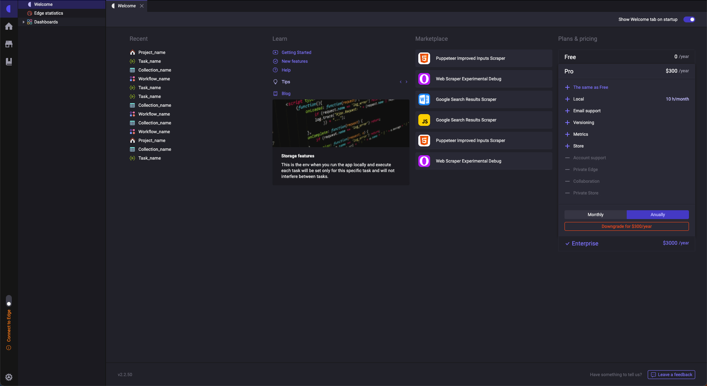
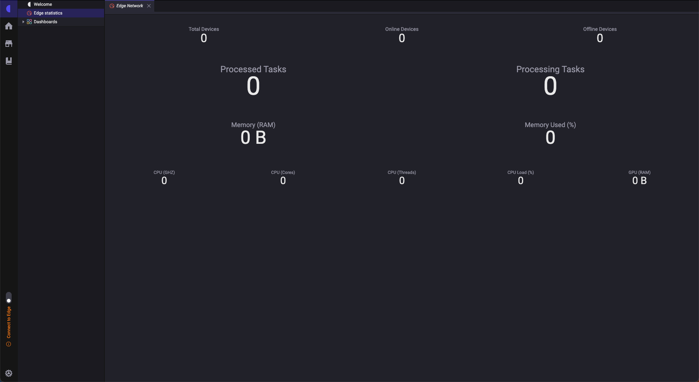
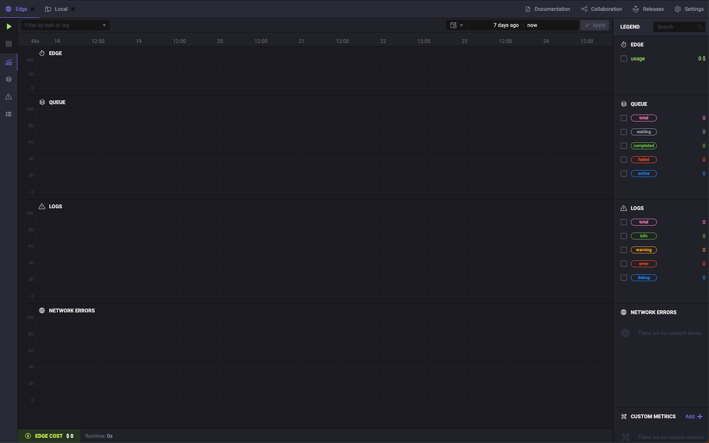
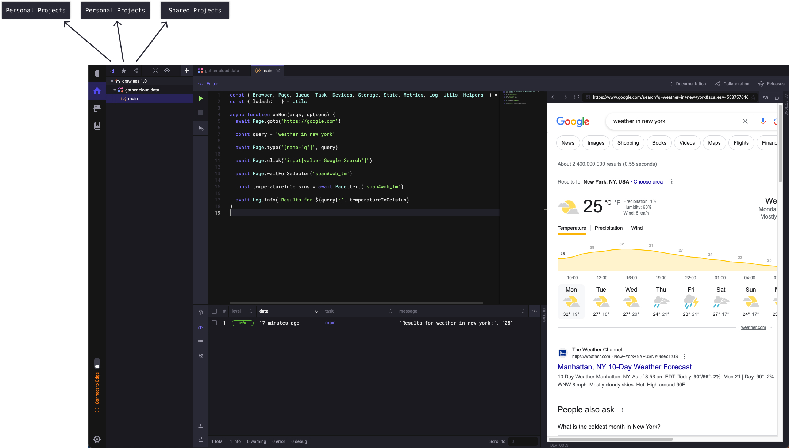
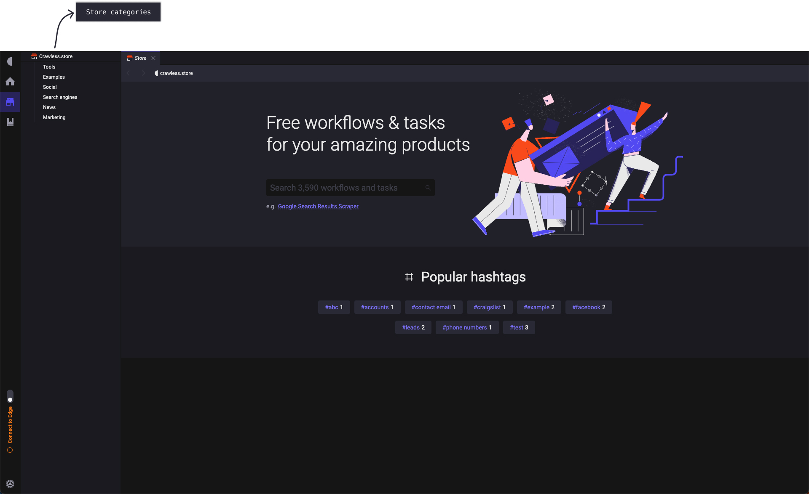
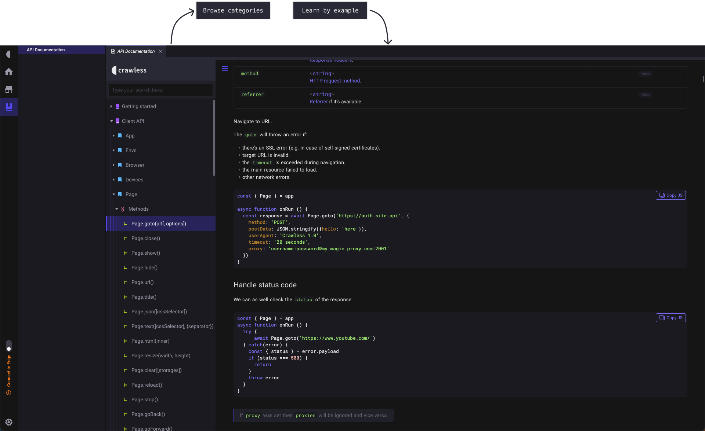

# Crawless in action

> The following is a comprehensive guide on getting started and becoming proficient with the Crawless IDE.

By this point, we are expecting you to have Crawless installed and running well on your system.

## Using the IDE

> Crawless, like any other IDE (integrated development environment), essentially is a text editor with extra features, that serves as an environment to achieve your goals without compromising productivity, by having all necesarry tools at hand.

### User Interface

> The user interface consists of three main areas, the activity bar, the sidebar, and the view container.

#### Activity Bar

In the far left side you find the `Activity Bar` which lets you switch between views, set preferences, and `Connect to Edge`.

> Switching to a view in the `Activity Bar` will open the corresponding navigation in the `Side Bar`.

> `Connect to Edge` is a feature that allows you to connect to a Crawless Edge instance, and use it as a remote execution environment for your projects.

#### Side Bar

Next is `Side Bar` which contains a more detailed navigation and actions for the current view.

#### View Container

The `View Container` is where the content of the current view is shown.

Move on to the following chapters to learn more about the content for each view.

### Views

#### Home

> `Home` view serves as a starting point for your work in Crawless, get quickly to your projects, and find useful links and information.

It contains the following sections:

> `Welcome` - the fastest way to access your recent projects, community, and get help.

> `Edge Statistics` - the summary of your Edge instances computational resources usage.

> `Dashboards` - a finer grained collection of metrics for your projects and instances.

#### Projects

> `Projects` view is where you create and organize your personal and shared projects containing automation workflows.

Here you can create a new project, or import an existing one and if necessary export it to a file, or share it with your collaborators.

For detailed documentation on automation workflows, please refer to the [Automation Workflows](#automation-workflows) section.

#### Store

> The `Store` is where you may find and install Crawless tools and extensions, but also get ready workflows and tasks to bootstrap your ideas.

#### Documentation

> The `Documentation` view is where one quickly accesses the necessary information on how to operate the Crawless IDE and use the automation API provided by it in your workflows.

## Automation Workflows

> In this section we will explore the automation workflows, and how to use them to achieve your goals.

## Best Practices
