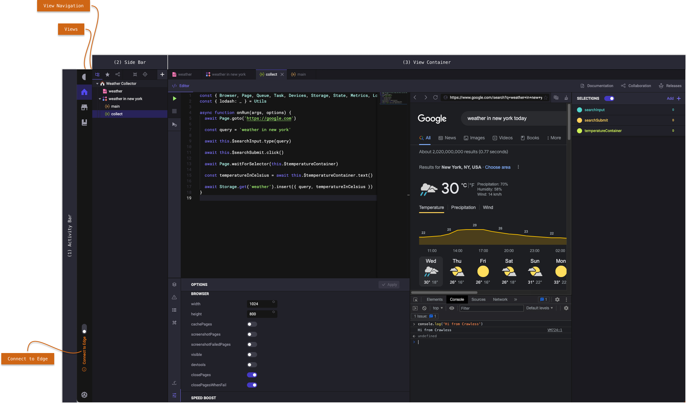
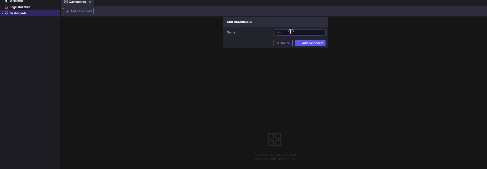

# Crawless in action

> The following is a comprehensive guide on getting started and becoming proficient with the Crawless IDE.

- [Using the IDE](#using-the-ide)
  - [User Interface](#user-interface)
  - [Views](#views)
    - [Home](#home)
    - [Projects](#projects)
    - [Store](#store)
    - [Documentation](#documentation)
- [Automation](#automation)
- [Best Practices](#best-practices)

## Using the IDE

> Crawless, like any other IDE (integrated development environment), essentially is a text editor with extra features, that serves as an environment to achieve your goals without compromising productivity, by having all necesarry tools at hand.

### User Interface

> The user interface consists of three main areas, the activity bar, the sidebar, and the view container.

#### Activity Bar

In the far left side you find the `Activity Bar` which lets you switch between views, set preferences, and `Connect to Edge`.

> Switching to a view in the `Activity Bar` will open the corresponding navigation in the `Side Bar`.

> `Connect to Edge` is a feature that allows you to connect to a Crawless Edge instance, and use it as a remote execution environment for your projects.

#### Side Bar

Next is `Side Bar` which contains a more detailed navigation and actions for the current view.

#### View Container

The `View Container` is where the content of the current view is shown.

Move on to the following chapters to learn more about the content for each view.

### Views

#### Home

> The `Home` view serves as a starting point for your work in Crawless, get quickly to your projects, and find useful links and information.

It contains the following sections:

- **Welcome** - the fastest way to access your recent projects, community, and get help.
- **Edge Statistics** - the summary of your Edge instances computational resources usage.
- **Dashboards** - a finer grained collection of metrics to monitor your workflows.

<figure>
    
    <figcaption align="center"><b>Setting up and using a dashboard to quickly monitor your workflows</b></figcaption>
</figure>

#### Projects

> A project is a collection of workflows and storages.

> A workflow is a collection of tasks, that are executed in a specific order, and may depend on each other or run in a parallel queue.

> A task is a piece of code that performs a specific action, and may be written in any programming language supported by Crawless via its API.

> A storage is where we optionally store any data collected during the process of our workflow, and may be a database, a file, or a cloud storage.

Please, refer to the [Automation](#automation) section for more information on how to create and manage your projects.

#### Store

> The `Store` is where you may find and install third-party Crawless tools and extensions, but also get ready workflows and tasks to bootstrap your ideas.

#### Documentation

> The `Documentation` view is where one quickly accesses the necessary information on how to operate the Crawless IDE and use the automation API provided by it in your code.

## Automation

### Workflows

#### Tasks

#### Monitoring

### Storage

## Best Practices
