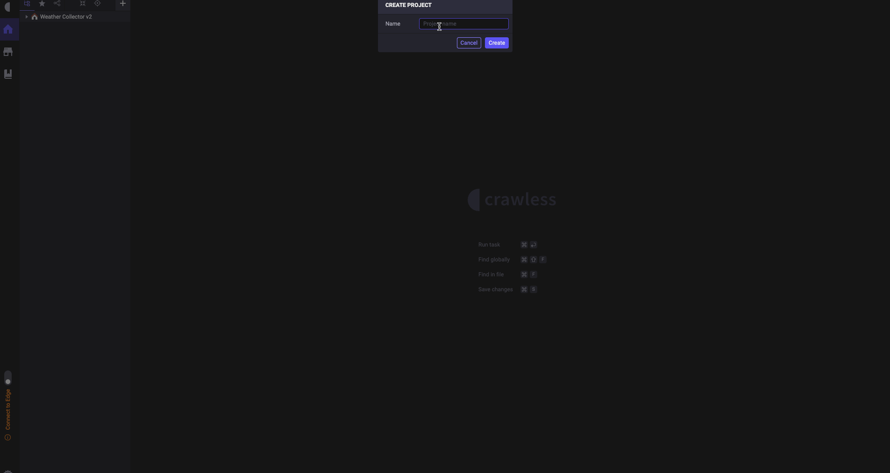

# Crawless in action

> The following is a comprehensive guide on getting started and becoming proficient with the Crawless IDE.

- [Introduction](#introduction)
  - [User Interface](#user-interface)
  - [Views](#views)
    - [Home](#home)
    - [Projects](#projects)
    - [Store](#store)
    - [Documentation](#documentation)
- [Using the IDE](#using-the-ide)
  - [Tasks](#tasks)
  - [Queue](#queue)
  - [State](#state)
  - [Storage](#storage)
  - [Logs](#logs)
  - [Metrics](#metrics)
- [Best Practices](#best-practices)

## Introduction

> Crawless, like any other IDE (integrated development environment), essentially is a text editor with extra features, that serves as an environment to achieve your goals without compromising productivity, by having all necessary tools at hand.

### User Interface

> The user interface consists of three main areas, the activity bar, the sidebar, and the view container.

#### Activity Bar

In the far left side you find the `Activity Bar` which lets you switch between views, set preferences, and `Connect to Edge`.

> Switching to a view in the `Activity Bar` will open the corresponding navigation in the `Side Bar`.

> `Connect to Edge` is a feature that allows you to connect to a Crawless Edge instance, and use it as a remote execution environment for your projects.

#### Side Bar

Next is `Side Bar` which contains a more detailed navigation and actions for the current view.

#### View Container

The `View Container` is where the content of the current view is shown.

Move on to the following chapters to learn more about the content for each view.

### Views

#### Home

> The `Home` view serves as a starting point for your work in Crawless, get quickly to your projects, and find useful links and information.

It contains the following sections:

- **Welcome** - the fastest way to access your recent projects, community, and get help.
- **Edge Statistics** - the summary of your Edge instances computational resources usage.
- **Dashboards** - a compact collection of metrics to monitor all your workflows in a single place.

#### Projects

> The `Projects` view is where you may create, manage, share, run, and monitor your automation.

<figure>
    
    <figcaption align="center"><b>Creating a project, and running a workflow</b></figcaption>
</figure>

To learn more about each aspect of a project, please, refer to the [Using the IDE](#using-the-ide) section.

#### Store

> The `Store` is where you may find and install third-party Crawless tools and extensions, but also get ready workflows and tasks to bootstrap your ideas.

#### Documentation

> The `Documentation` view is where one quickly accesses the necessary information on how to operate the Crawless IDE and use the automation API provided by it in your code.

## Using the IDE

> The process of automation within the Crawless IDE begins with the creation of a **project** and a **workflow** within it, followed by creation of **tasks** out of which a workflow consists, and an optional **storage** instance to cache intermediate or store final data.

### Tasks

> A task is a piece of code, following the [Crawless API](https://docs.stage.crawless.com) convention, executes a specific set of actions in the same manner as a real user would do. ??

> A task may be executed in a specific order, and may depend on other tasks or run in a parallel [queue](#queue).

> Tasks may share data between each other using the [state](#state), and store final data in a [storage](#storage).

<figure>
    
    <figcaption align="center"><b>Tasks</b></figcaption>
</figure>

### Queue

### State

### Storage

> A storage is where we optionally store any data collected during the process of our workflow in order to cache and re-use data or export it as our final result, and may be a database, a file, or a cloud storage.

### Logs

### Metrics

> As soon as you created a project, you may wish to monitor the activity of its workflows and the usage of the computational resources for each process, as well as being informed with notifications about the state of your automation.

In Crawless, we offer two ways to monitor your workflows, one is by creating a dashboard entry on the `Dashboards` view, which allows you to visualize multiple metrics for multiple workflows simultaneously in a single location, and per workflow by clicking on it in the `Projects` view.

<figure>
    
    <figcaption align="center"><b>Setting up and using a dashboard to quickly monitor your workflows</b></figcaption>
</figure>

## Best Practices

- **Organization** - keep your workflows organized by splitting them into smaller tasks, and grouping them into modules.
- **Modularity** - make your tasks reusable by making them independent of each other, and using them in multiple workflows.
- **Optimization** - optimize your tasks by making them run in parallel [queues](https://docs.stage.crawless.com/#/app/queue), use the [state](https://docs.stage.crawless.com/#/app/state) to cache and share data between tasks, and make use of the [storage](https://docs.stage.crawless.com/#/app/storage) to store final data.
- **Documentation** - document your code, so that others may understand it, and you may remember it.
- **Consistency** - be consistent with your code style, and naming conventions, so that you may easily navigate your codebase.
- **Testing** - test your code, so that you may be confident in its correctness, and others may trust it.
- **Debugging** - use the [logs](https://docs.stage.crawless.com/#/app/log) to debug your code, so that you may quickly find and fix issues.
- **Versioning** - version your code, so that you may track its changes, and others may contribute to it.
- **Community** - use store based third party tools and extensions provided by the community and Crawless team, so that you may save time, and others may benefit from your work.
- **Monitor** - take full advantage of the metrics features within the Crawless IDE to monitor your workflows, so that you may be aware of their state, and be notified of any issues.
- **Learn** - always consult the latest [documentation](https://docs.stage.crawless.com) and changelogs, so that you may be aware of the latest features, thus improving your productivity.