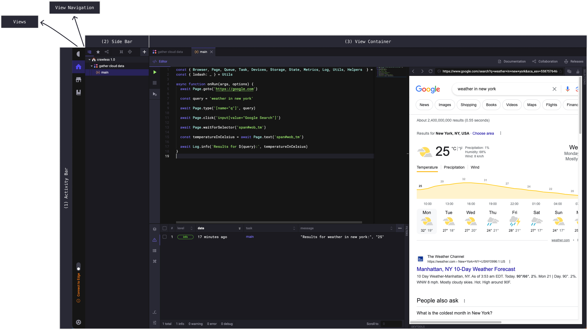

# Crawless in action

> The following is a comprehensive guide on getting started and becoming proficient with the Crawless IDE.

By this point, we are expecting you to have Crawless installed and running well on your system.

## Using the IDE

> Crawless, like any other IDE (integrated development environment), essentially is a text editor with extra features, that serves as an environment to achieve your goals without compromising productivity, by having all necesarry tools at hand.

### User Interface

The user interface consists of three main areas.

#### Activity Bar

In the far left side you find the `Activity Bar` which lets you switch between views, set preferences, and `Connect to Edge`.

> Switching to a view in the `Activity Bar` will open the corresponding navigation in the `Side Bar`.

> `Connect to Edge` is a feature that allows you to connect to a Crawless Edge instance, and use it as a remote execution environment for your projects.

#### Side Bar

Next is `Side Bar` which contains a more detailed navigation and actions for the current view.

#### View Container

The `View Container` is where the content of the current view is shown.

### Views

#### Home

#### Projects

#### Store

#### Documentation

As soon as you open Crawless you shall see the Welcome screen, but let me explain all the menus and buttons before diving into the actual screens.

First of all, you have the sidebar

## Best Practices
