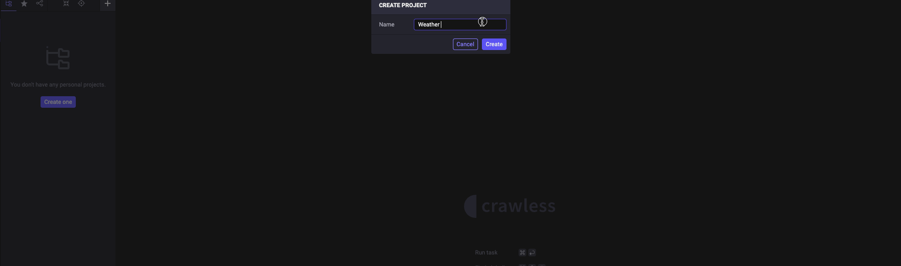
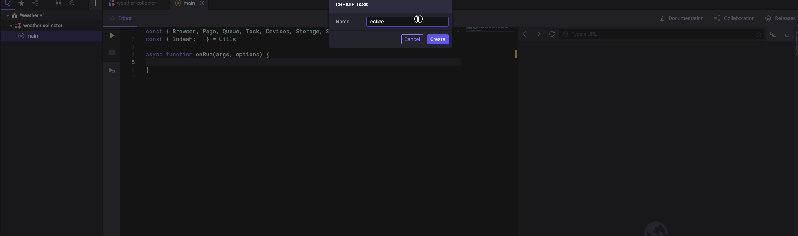
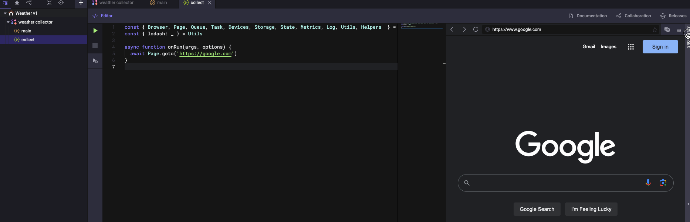
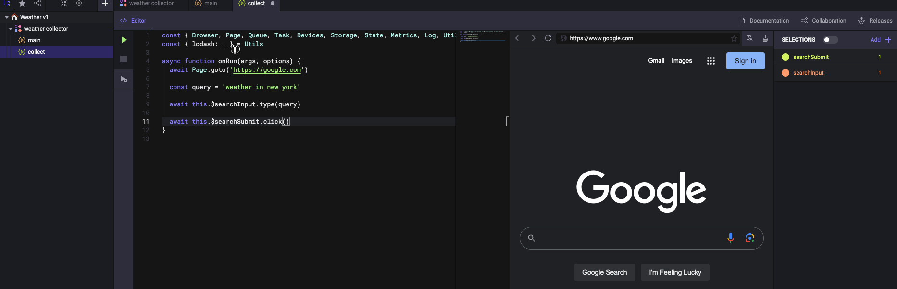
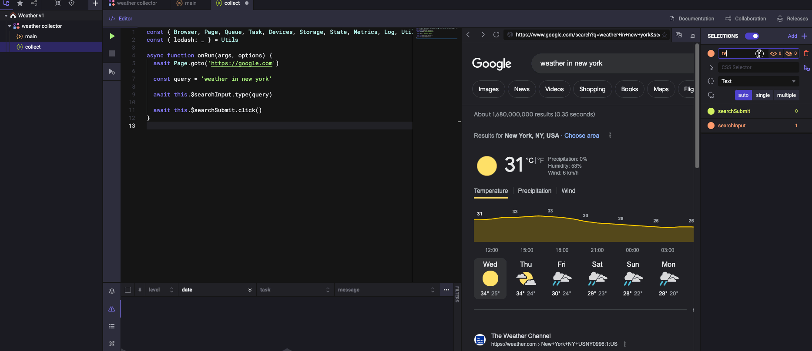
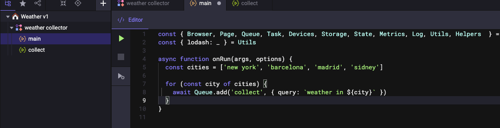
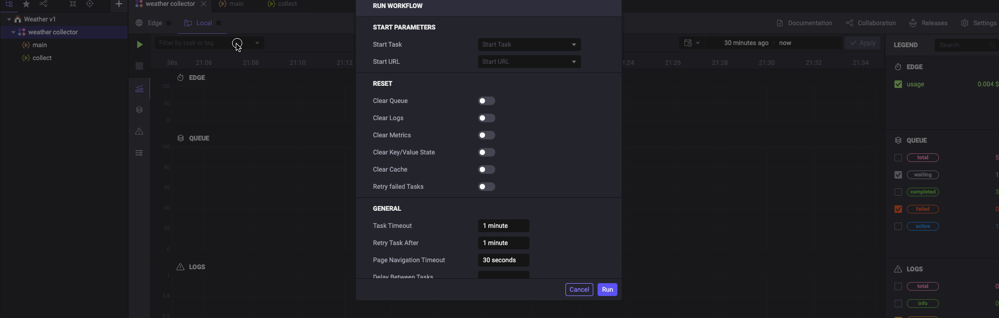

# Crawless in action

> The following is a comprehensive guide on getting started and becoming proficient with the Crawless IDE.

- [Introduction](#introduction)
  - [User Interface](#user-interface)
  - [Views](#views)
    - [Home](#home)
    - [Projects](#projects)
    - [Store](#store)
    - [Documentation](#documentation)
- [Using the IDE](#using-the-ide)
  - [Tasks](#tasks)
  - [Queue](#queue)
  - [State](#state)
  - [Storage](#storage)
  - [Logs](#logs)
  - [Metrics](#metrics)
- [Best Practices](#best-practices)

## Introduction

> Crawless, like any other IDE (integrated development environment), essentially is a text editor with extra features, that serves as an environment to achieve your goals without compromising productivity, by having all necessary tools at hand.

### User Interface

> The user interface consists of three main areas, the activity bar, the sidebar, and the view container.

#### Activity Bar

In the far left side you find the `Activity Bar` which lets you switch between views, set preferences, and `Connect to Edge`.

> Switching to a view in the `Activity Bar` will open the corresponding navigation in the `Side Bar`.

> `Connect to Edge` is a feature that allows you to connect to a Crawless Edge instance, and use it as a remote execution environment for your projects.

#### Side Bar

Next is `Side Bar` which contains a more detailed navigation and actions for the current view.

#### View Container

The `View Container` is where the content of the current view is shown.

Move on to the following chapters to learn more about the content for each view.

### Views

#### Home

> The `Home` view serves as a starting point for your work in Crawless, get quickly to your projects, and find useful links and information.

It contains the following sections:

- **Welcome** - the fastest way to access your recent projects, community, and get help.
- **Edge Statistics** - the summary of your Edge instances computational resources usage.
- **Dashboards** - a compact collection of metrics to monitor all your workflows in a single place.

#### Projects

> The `Projects` view is where you may create, manage, share, run, and monitor your automation.

To learn more about each aspect of a project, please, refer to the [Using the IDE](#using-the-ide) section.

#### Store

> The `Store` is where you may find and install third-party Crawless tools and extensions, but also get ready workflows and tasks to bootstrap your ideas.

#### Documentation

> The `Documentation` view is where one quickly accesses the necessary information on how to operate the Crawless IDE and use the automation API provided by it in your code.

## Using the IDE

> The process of automation within the Crawless begins with the creation of a project and a workflow within it, followed by creation of tasks out of which a workflow consists, and an optional storage instance to store collected or intermediate data.

> Note that you can also import an existing workflow or work on a project that had been shared with you.

### Tasks

> A task, in the context of Crawless, is a piece of code, written in `JavaScript`, following the [Crawless API](https://docs.stage.crawless.com) convention and a set of configurations that instructs the Crawless and its underlying framework on how it should execute a specific set of actions in the same manner as a real user would do.

> A task may be executed in a specific order, and may depend on other tasks or run in a [queue](#queue).

> Tasks may share data between each other using the built-in [state](#state) feature, and store final data in a [storage](#storage).

Begin with creation of a new project, and a workflow within it.

Once created, you may add tasks to your workflow, fill in with code, and configure them to your needs.

> You will notice that every workflow comes with a default task called `main` - this is the entry point of your workflow, and the first task to be executed. You may create as many tasks as you wish, organize, and use them in any order you like.

> Also, note that you may configure and run your tasks directly from their own editor view, by clicking on the task, or from the workflow dashboard view, by clicking on the workflow in the sidebar and selecting the task you wish to run.

As a demonstration, we will create a task that collects the current weather in the New York City.

First we will create our `collect` task, which we will include in our `main` task.

On the right side of our opened code editor view, you will find the `Browser` and the `Selectors` panes. The `Browser` pane allows us to navigate to the desired destination and visualize the performance of our tasks, and the `Selectors` pane allows us to interactively find and save the necessary elements into variables, so we can reuse them later.

Assuming we want to extract the current weather in New York City from Google, step by step, we will navigate to our desired destination, set up the necessary selectors, and write our code.

We will need to select the search input field, and the search button, so we can type in our query and submit it.

Next, we will add the code which will enter our query into the search field and submit it.

Once done, let's select the first result from the search results page, in our case the text with the current temperature in New York City, and log it to the console.

This is a brief demonstration on how to get started with automation in Crawless, but we are just scratching the surface, follow to the next chapters to learn how to scale to a different level.

### Queue

> The [queue](https://docs.stage.crawless.com/#/app/queue) feature is a way to execute multiple tasks in background and make sure they run repeatedly if the execution failed, thus not blocking the main execution of the program, and can be also used to schedule tasks to run at a specific time or interval.

Following our previous example, we will create a queue to execute multiple `collect` tasks in the background thus fetch weather data for multiple cities.

Let's include the necessary code in our `main` task.

And run the workflow from the workflow dashboard view.

As you can see, the `collect` task is executed multiple times, and the data is logged to the console.

Feel free to tinker on your own, and try to create a queue that will run at a specific time or interval using the [schedule](https://docs.stage.crawless.com/#/app/queue?id=schedule) feature.

### State

> State instance provides methods to work with key-value data. The data is saved across your workflow, and you may use it to share stuff between tasks.

Let's use the state feature to store weather data, collected by our `collect` task, and instead of directly logging it to the console, we will log it from the `main` task.

### Storage

> A storage is where we optionally store any data collected during the process of our workflow, usually the fruit of our automation, and may be a `SQL` or `NoSQL` database, a file, or a cloud storage.

Following the previous example, we will create a storage, and instead of logging the weather data to the console, we will store it in the storage.

Let's create a simple file storage on our local machine with the `JSON` format.

Next, add the necessary code to our `main` task to save collected weather data into the storage and visualize it.

In the `Storage` view, you will find the `Files` pane, which allows you to navigate and manage your storage files and instances.

Crawless supports a variety of storage types, and you may find more information about them in the [documentation](https://docs.stage.crawless.com/#/app/storage).

### Logs

> The [logs](https://docs.stage.crawless.com/#/app/log) feature allows you to debug your code by logging messages to the console, and monitor the activity of your workflows.

### Metrics

> As soon as you created a project, you may wish to monitor the activity of its workflows and the usage of the computational resources for each process, as well as being informed with notifications about the state of your automation.

In Crawless, we offer two ways to monitor your workflows.

One is by opening the workflow view and monitoring the metrics in the `Summary` pane.

And another is by creating a dashboard entry on the `Dashboards` view, which allows you to visualize multiple metrics for multiple workflows simultaneously in a single location.

<figure>
    
    <figcaption align="center"><b>Setting up and using a dashboard to quickly monitor your workflows</b></figcaption>
</figure>

## Best Practices

- **Organization** - keep your workflows organized by splitting them into smaller tasks, and grouping them into modules.
- **Modularity** - make your tasks reusable by making them independent of each other, and using them in multiple workflows.
- **Optimization** - optimize your tasks by making them run in [queues](https://docs.stage.crawless.com/#/app/queue), use the [state](https://docs.stage.crawless.com/#/app/state) to cache and share data between tasks, and make use of the [storage](https://docs.stage.crawless.com/#/app/storage) to store final data.
- **Documentation** - document your code, so that others may understand it, and you may remember it.
- **Consistency** - be consistent with your code style, and naming conventions, so that you may easily navigate your codebase.
- **Testing** - test your code, so that you may be confident in its correctness, and others may trust it.
- **Debugging** - use the [logs](https://docs.stage.crawless.com/#/app/log) to debug your code, so that you may quickly find and fix issues.
- **Versioning** - version your code, so that you may track its changes, and others may contribute to it.
- **Community** - use store based third party tools and extensions provided by the community and Crawless team, so that you may save time, and others may benefit from your work.
- **Monitor** - take full advantage of the metrics features within the Crawless to monitor your workflows, so that you may be aware of their state, and be notified of any issues.
- **Learn** - always consult the latest [documentation](https://docs.stage.crawless.com) and changelogs, so that you may be aware of the latest features, thus improving your productivity.